# Resume Manager
**System of quick resumes processing and attracting the right candidates**
1. [Getting Started](#getting-started)
2. [Overview](#overview)
    * [Our team](#our-team)
    * [Understanding Customer needs](#understanding-customer-needs)
    * [What we offer?](#what-we-offer)
    * [Requirements](#requirements)
    * [Architecture type](#architecture-type)
    * [Technology stack](#technology-stack)
    * [Database scheme](#database-scheme)
3. [Demonstration](#demonstration)
   * [Upload resume](#upload-resume) 
   * [Candidates](#candidates) 
   * [Vacancies](#vacancies) 
   * [Admin Page](#admin-page) 
   * [Profile](#profile) 


## Getting Started

**Server side.**

At first, change Java version to 17: [How to do it?](https://www.happycoders.eu/java/how-to-switch-multiple-java-versions-windows/)

To run project with "Run" button:
1. You'll see "maven build script found", press "load".
2. If there's no such message, delete ".idea" folder and reopen Intelij.
3. Open "ResumeManagerApplication" file and press "trust project".
4. Wait for the dependencies to load.

You also need to set enviroment variables before start.
They are:
1. MYSQL_DB_HOST
2. MYSQL_DB_PORT
3. MYSQL_DB_NAME
4. MYSQL_DB_USERNAME
5. MYSQL_DB_PASSWORD
6. MY_SECRET_KEY

Steps:
1. "Edit Configurations" on the right of build button.
2. Press on "Enviroment variables" field.
3. Shift+Enter
4. Add variables names and values
5. Press "OK" -> "Apply" -> "OK"

**Client.**

1. Install the Node.js server and the npm [Node.js](https://nodejs.org/en/) package manager
2. Install all required dependencies with the ```npm install``` command

That's all.
## Overview

### Our team
* Oleksandr Adamenko [GitHub](https://github.com/alexander-adamenko)

* Andrii Sliusarenko [GitHub](https://github.com/anrysliusar)

* Anastasia Hrynenko [GitHub](https://github.com/Grynya)

We are a team of three motivated, self-disciplined developers, who are always open to new tasks.

### Understanding Customer needs


### What we offer?
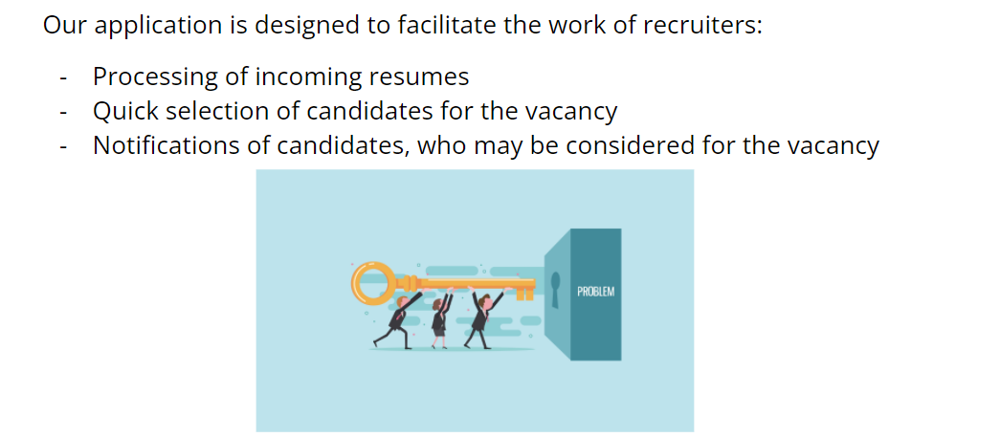

### Requirements
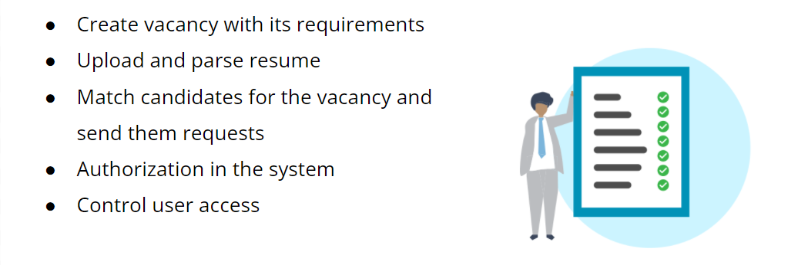

### Architecture type


### Technology stack
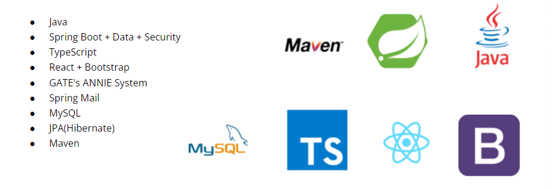

### Database scheme
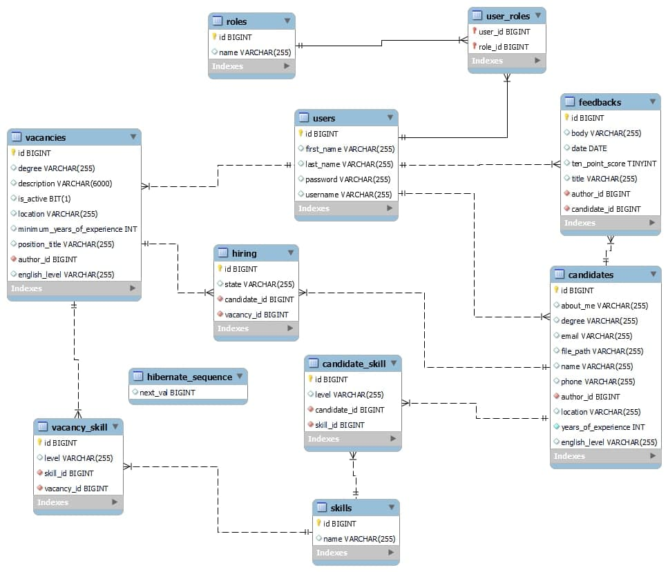

## Demonstration
The application consists of five main pages: `Profile, Admin, Upload Resume, Candidates, Vacancies`

More about each page:
### Upload resume
Let's start with processing of incoming resumes:

Here you can upload the resume and the system will automatically read it and give result of the parsing.

Then you can check it (you can edit the data in fields) and if all the fields are filled in correctly, save the candidate's resume


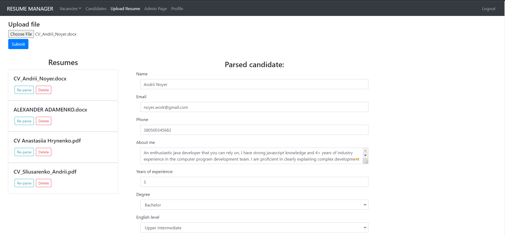
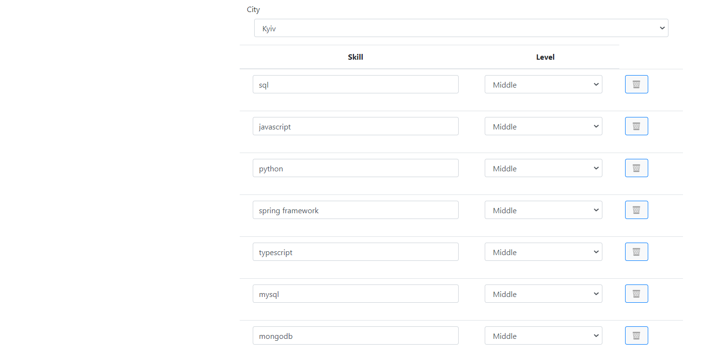
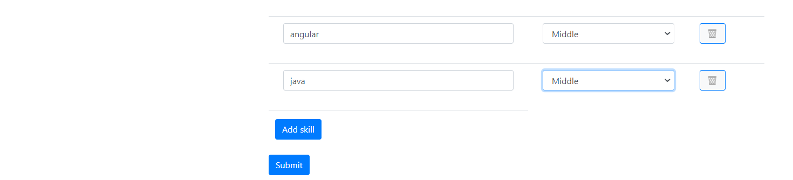

### Candidates
Here is a list with a brief description of all processed candidates


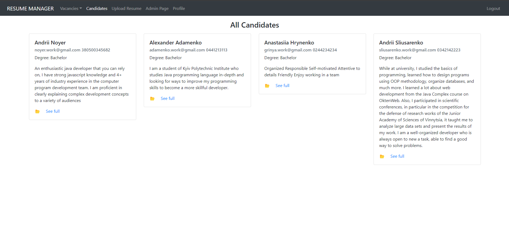

If you click on `see full` button you can see the full description of the candidate:


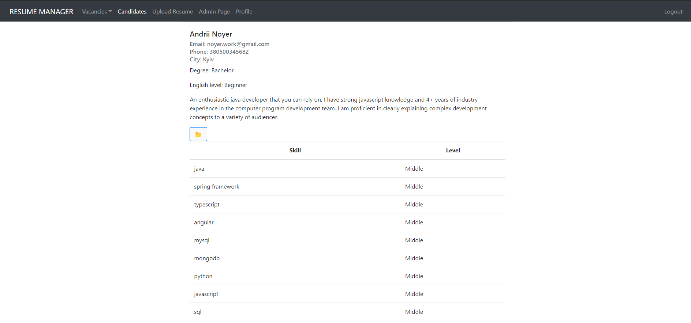

### Vacancies
Here you can see a list of all vacancies or create a new vacancy.

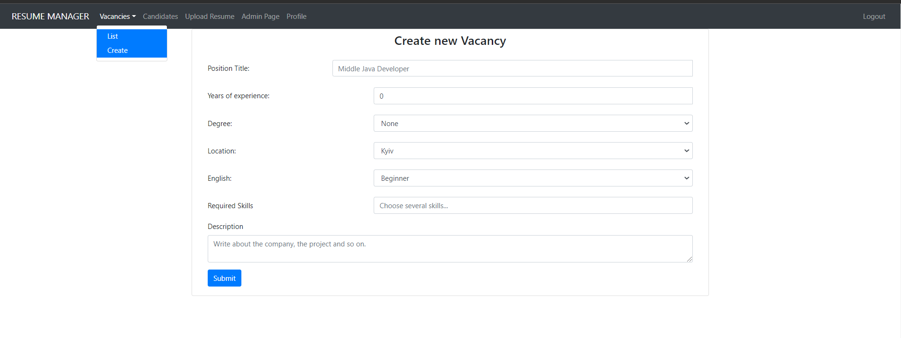

For example, let's create a vacancy Junior Java engineer: set all the necessary requirements, description and add some skills

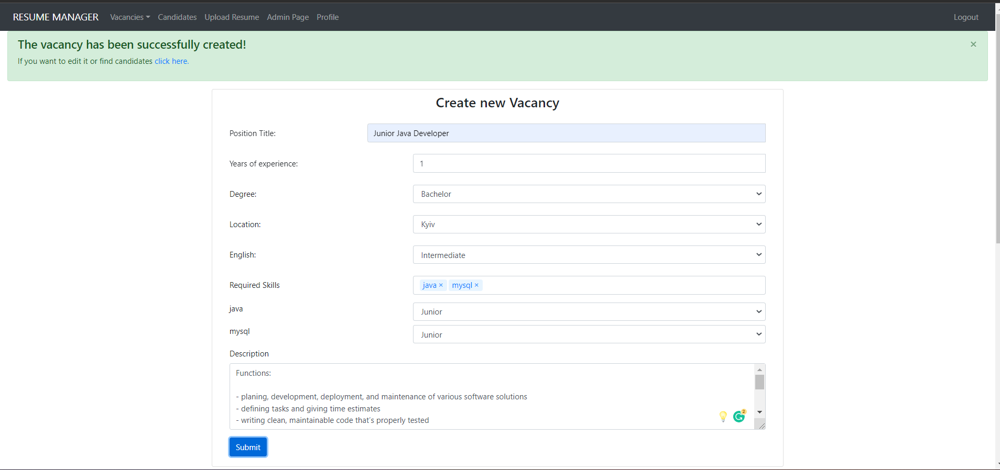

Then you can edit the created vacancy.

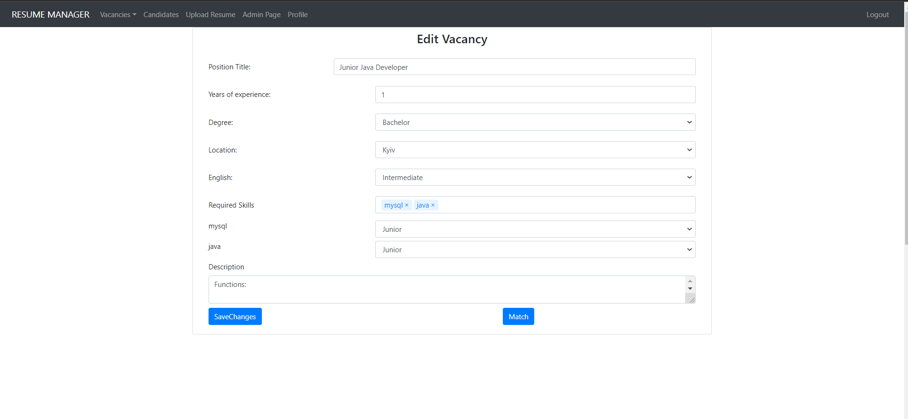

Finally, we are ready to select candidates for this vacancy. To do this, click on the `match`:

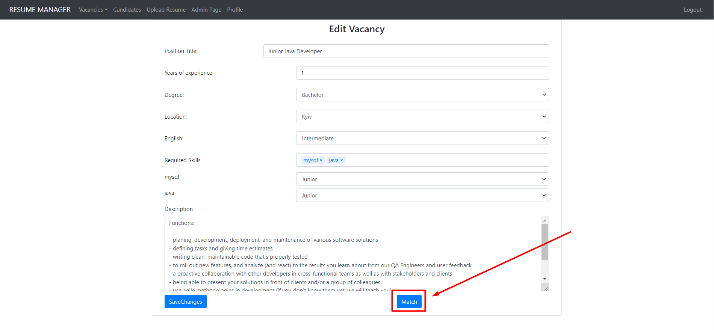

Congratulations, now we have a list of candidates who are suitable for this vacancy:

Here you can filter candidates by `Degree`, `English level`, `years of experience`, and click on `Link` to view the profile of the selected candidate

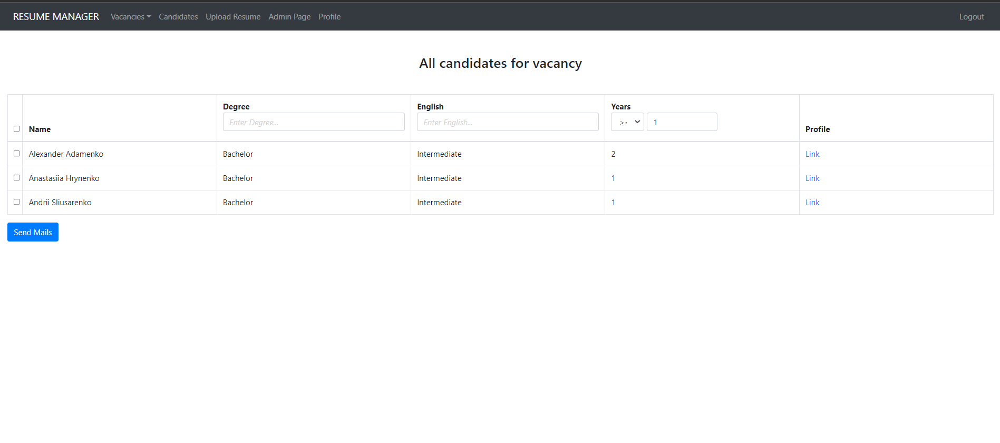

When you have decided which of the candidates you would like to notify about the vacancy, you can select them and click on the `send`. 

The system will send a letter to each of them with a description of the vacancy.

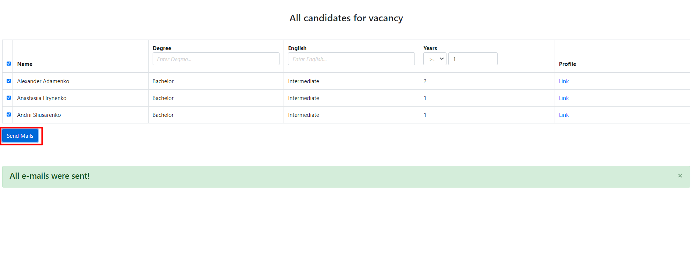

For example, a letter to this vacancy:

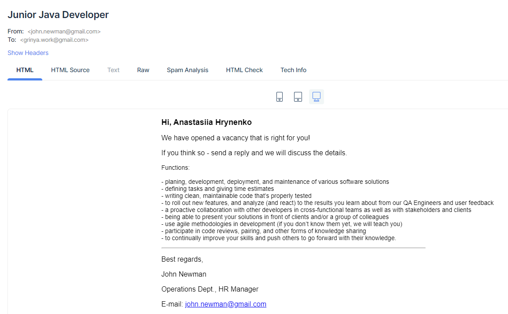

### Admin Page
Here implemented a user management system:
User with the role `Admin` can:
* Add or delete roles of users

  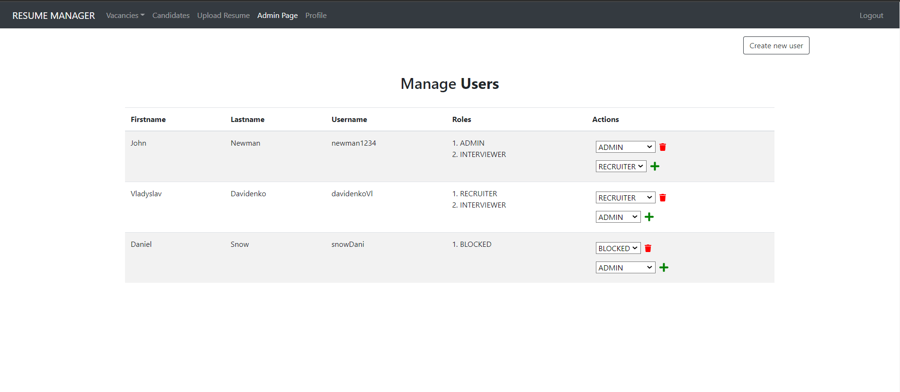
* Create new user:

  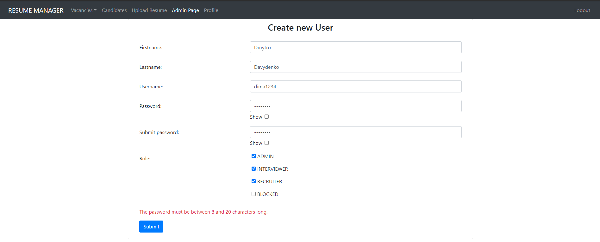

### Profile
On this page you can edit information about the current user: 
* Lastname
* Firstname
* Username 
* Change password

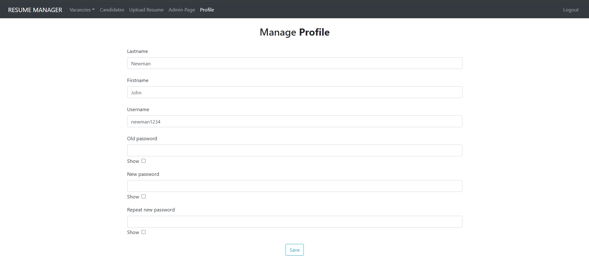


